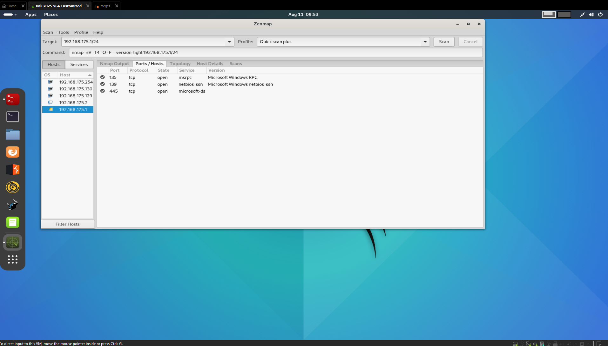

# Network Hacking Post Connection Attacks - Information Gathering


## Discovering Devices Connected to the Same Network

- Information Gathering is one of the most important steps when it comes to hacking or penetration testing. If you think of it you can't really gain acccess to a system, if you don't have enough information about it.

- So, let's say we are connected to the network, and one of the devices connected to the network is our target. Now, for us to hack into the target, first we need to discover all of the connected clients to this network, get their MAC Address, their IP Address, and than from there try to maybe gather more information or run some attacks in order to gain access to the target.

- Their are a number of programs that will do this for us. Examples of these programs are:

  - **Nmap**: A powerful network scanning tool that can discover hosts and services on a computer network.
  - **Netdiscover**: A simple tool for network address discovery, useful for identifying live hosts on a network.
  - **ARP Scan**: A command-line tool that uses ARP requests to discover devices on a local network.

- Right now, we will use `Netdiscover` to discover devices connected to the same network.

  Let's say we have some IP of the inet `10.0.2.16`, and we can only access the IPs on the same subnet. So, IPs on the same subnet start with `10.0.2.x`, where `x` can be any number from `0` to `254`. `254` is the last IP in the subnet.

  ```bash
  root@kali:~# netdiscover -r XX.XX.XX.1/24
  ```

    > [!NOTE]
    > `XX.XX.XX.1/24` is the way in which we can specify IP for the whole subnet. The `/24` means that the first 24 bits of the IP address are fixed, which corresponds to the subnet mask.

- You will get the following output:

    ```
    Currently scanning: Finished!   |   Screen View: Unique Hosts                                                       
                                                                                                                        
    4 Captured ARP Req/Rep packets, from 4 hosts.   Total size: 240                                                     
    _____________________________________________________________________________
    IP            At MAC Address     Count     Len  MAC Vendor / Hostname      
    -----------------------------------------------------------------------------
    XXX.XX.XX.X     XX:XX:XX:XX:XX:XX      1      60  Unknown vendor                                                    
    XXX.XX.XX.X     XX:XX:XX:XX:XX:XX      1      60  VMware, Inc.                                                      
    XXX.XX.XX.XXX   XX:XX:XX:XX:XX:XX      1      60  VMware, Inc.                                                      
    XXX.XX.XX.XXX   XX:XX:XX:XX:XX:XX      1      60  VMware, Inc.                   
    ```

- And, right now we have a list of all the connected clients to the same network. We can also use this method to discover clients connected to the same wifi network.

  >[!IMPORTANT]
  > If there's any issue with the command, use the option `-c` to specify the number of packets to send, and `-i` to specify the interface you want to use. For example:

  ```bash
  root@kali:~# netdiscover -r XX.XX.XX.1/24 -c 10 -i <interface_name/>
  ```


## Gathering Sensitive Information about Connected Devices

- Now, the second program that we will use for Network Mapping is `Nmap`. Nmap is a powerful network scanning tool that can discover hosts and services on a computer network.

- Nmap takes scanning to a whole new level. It is slightly slower than `Netdiscover`, but it provides a lot more information about the connected devices. It can also be used to scan for open ports, services running on those ports, and even the operating system of the device, connected clients, and more. You can bypass security firewalls etc..

- Nmap is a huge tool and, there are books and complete courses just on learning to use Nmap. We will be using Zenmap, which is a graphical user interface for Nmap. It is easier to use and provides a more user-friendly experience.

- Use the command `zenmap` to open `Nmap` UI:

  ```bash
  root@kali:~# zenmap
  ```

  

- It has a very simple interface. You can enter the target IP address or hostname in the "Target" field, and then select the type of scan you want to perform from the "Profile" dropdown menu.

- Enter the target range in the "Target" field, for example `XX.XX.XX.1/24`, and select the "Intense Scan" profile from the dropdown menu. Then click on the "Scan" button to start the scan.

  

- As you can see here, it is scanning the target range for open ports, services running on those ports, and even the operating system of the device. It will take some time to complete the scan, depending on the size of the target range and the number of devices connected to it.

- Let's see how to perform a ping scan:

  


- Here, we can see what kind of device is connected to the network, what operating system it is running. As, we can see here, we have 3 VMware devices connected to the network, and one of them is running an Unknown OS. 

- In a similare way we can perform quick scan as well:

  

- It shows open ports on each one of the discovered devices, along with the services running on those ports. For example, we can see that port `22` is open on the device with IP.

### Gathering More Sensitive Information(Services, OS, etc.)

  

- As here we can clearly see, that the device has it's IP, MAC Address, and the services running on it. We can also see the operating system of the device. 

- It also shows us the program running on the open ports, and the versions of these programs, like here we can see the Apple device has Postgres on port `5432`, and the version is `9.6.0` or later.

- We can check for the exploits for the version of the program/service running on the open ports. For example, we can search for exploits for `Postgres 9.6.0` or later. And, we will be able to gain access to the device using these exploits.

- We can also categorize discovered clients based on the services running on them.

  