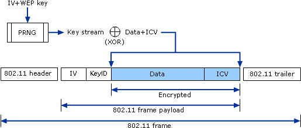

# Network Hacking - Gaining Access WEP Cracking

- Everything we did so for now didn't require us to have access/connection to the network.
- Now, once we connect to the network, we can not only start to see the data being transmitted, but we can also start to manipulate it.

---

## Theory behing cracking WEP Encryption

- WEP stands for Wired Equivalent Privacy.
- It is an older security protocol designed to provide a wireless local area network (WLAN) with a level of security and privacy comparable to what is usually expected of a wired LAN.
- It uses RC4 algorithm for encryption.
- It is still used in some older netowrks, and can be cracked in a matter of minutes.

```mermaid
flowchart LR
    A[Source Device] --> B["WEP Encryption - RC4 Algorithm"]
    B --> C[Encrypted Data Packet]
    C --> D[Wireless Transmission]
    D --> E[Access Point / Router]
    E --> F[Wireless Transmission]
    F --> G[Destination Device]
    G --> H["WEP Decryption - RC4 Algorithm"]
    H --> I[Original Data]
    I --> J[Destination Device]
```

```mermaid
sequenceDiagram
    participant Source as Source Device
    participant AP as Access Point / Router
    participant Dest as Destination Device

    Source->>Source: Data to send
    Source->>Source: WEP Encryption (RC4 Algorithm)
    Source->>AP: Encrypted Data Packet (wireless)
    AP->>Dest: Encrypted Data Packet (wireless)
    Dest->>Dest: WEP Decryption (RC4 Algorithm)
    Dest->>Dest: Original Data
```

- So, how it basically works is if a Client wants to send something to the router, let's say some kind of text data, it will encrypt this using a key. Therefore this normal text will be converted into gebrish.
- This encrypted packet will be sent in the air, so if a hacker captures this packet it will completely appear as gibberish to him, even though it contians some useful information.
- The access point will recieve this encrypted packet, and it will decrypt it using the same key that was used to encrypt it. And, hence the router will be able to read the original text data.
- The same happens if the router wants to send something to the client, it will first encrypt it using a key, send it to the client, and the client will be able to decrypt it because it has the key. So, the concept is always the same, the transmitter encrypts the data using a key, and the receiver decrypts it using the same key.

- So, than where's the vulenrability? The way RC4 alogirthm works is actually fine, the problem is with the way WEP implements this algorithm.

- To understand this better let's zoom in to the process deeply:

  - So, going back to the first step we have client trying to send some data to the router. Let's keep the assumption that the data sent is a text message.
  - In order to encrypt this, WEP tries to generate a unique key for each packet. So, literally each packet sent into the air, it tries to create a unique key for it.
  - To do that, it generates a 24 bit random number called an Initialization Vector (IV). The IV is than added to the password of the network. This generates a key stream, and than this key stream is used to encrypt the packet, and transform it into gebrish.
  - But, before sending this into the air, WEP will also append the IV to the packet. The reason why it does so is so that once the router recieves the packet, it needs to be able to decrypt it, and to do so it need the key and the IV. But, the router already has the key no need to send that, therefore we just need to send the IV.
  - So, when the router recieves the packet, it has the IV, it has the password, so it can generate the key stream, and than use it to transform the gebrish data into it's orignal form, and read the packet.

```mermaid
sequenceDiagram
    participant Client as Client
    participant Air as Wireless Transmission
    participant Router as Router

    Client->>Client: Prepare Text Message
    Client->>Client: Generate 24-bit IV
    Client->>Client: Combine IV + Password → Key Stream
    Client->>Client: Encrypt Text Message with Key Stream → Ciphertext
    Client->>Client: Append IV to Ciphertext
    Client->>Air: Send [IV + Ciphertext] over air
    Air->>Router: Deliver [IV + Ciphertext]
    Router->>Router: Extract IV from Packet
    Router->>Router: Combine IV + Password → Key Stream
    Router->>Router: Decrypt Ciphertext with Key Stream → Original Text
    Router->>Router: Read Original Text
```
